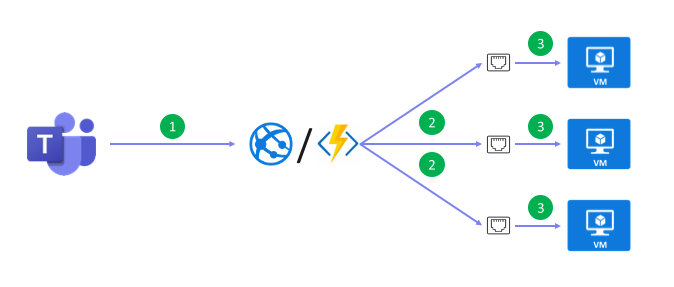

# Multi-tenant Teams Proxy
*This repository is meant to showcase the development of Microsoft Teams apps with a Multitenant Teams Proxy. It is not meant to be used in a production environment as-is.*

## Why you'll need this repository
Many ISVs traditionally follow a PaaS hosting model or are still in their migration from On-Prem to Azure – they face architectural challenges when integrating in Teams. The manifest file of a Teams app defines the messaging endpoint and the required URLs for tabs and connectors. In most cases, the configuration should not be customized for each installation or customer.

This leads in many cases to the following scenario:
- ISVs with a PaaS solution have specific endpoints for every single of their customers. This requires them to create a new Teams app for each deployment. 
- This approach greatly increases complexity, makes it impossible to list the app in the public app store and hard to track its impact in OCP. 

Therefor a new reference architecture was developed for (and with) our ISV partners, this so-called Multi-tenant Teams Proxy. 
Currently we are working with several ISVs (MPL and Recruit) who use this pattern to build a Teams app, removing a blocker for them that would have otherwise prohibited the integration. 

This repository contains a simplified implementation of this concept for demonstration purposes.

## Every app is a multi-tenant (Teams) app
Example of forwarding bot messages to the right tenant:

1) The ISV Teams app calls a proxy web app, hosted in their own Azure tenant. This app contains a mapping of customer tenants to customer app base URLs.
2) The proxy redirects the query to a well-known URL in the customers deployment.
3) Through the well-known URL, actions can be triggered in the customer deployment.

## Set up this project
This proxy is completely implemented in TypeScript, however all the concepts presented are based on REST and therefore completely programming language agnostic.

- [Create your Table Storage Container](https://docs.microsoft.com/en-us/azure/storage/tables/table-storage-overview)
- [Configure your Teams app manifest](https://docs.microsoft.com/en-us/microsoftteams/platform/get-started/get-started-app-studio)
- Setting the required environment variables (.env-example file)
- Run the proxy:
    - Npm:
        - installing dependencies: "npm install"
        - running the Teams proxy: "npm run-script start"
    - Yarn:
    - installing dependencies: "yarn install"
    - running the Teams proxy: "yarn run run"
- Deploy the App to your tenant

## How to extend this project
This proxy contains two endpoints for Bots and Tabs which can be extended.

The Bot Proxy:
- checks if an Authorization header is available
- parses the message and extracts the tenant Id
- looks up the corresponding endpoint for the tenant in the cache or in the database (Table Storage), if no cache entry is available or to old
- forwards the message to the defined endpoint for the tenant and return a 200 HTTP status code
- the message will be handled by the endpoint, which will communicate directly with the Teams Api

The Tabs Proxy:
- optionally checks if an Authorization header is available
- proxies the request to the defined endpoint

## Test Tenant
Microsoft provides the [Office Developer Program](https://developer.microsoft.com/en-us/office/dev-program). Included in this program is a renewable 90-day Office 365 subscription with a tenant and 25 E5 licenses where you can experiment with nearly all features in a safe environment.
